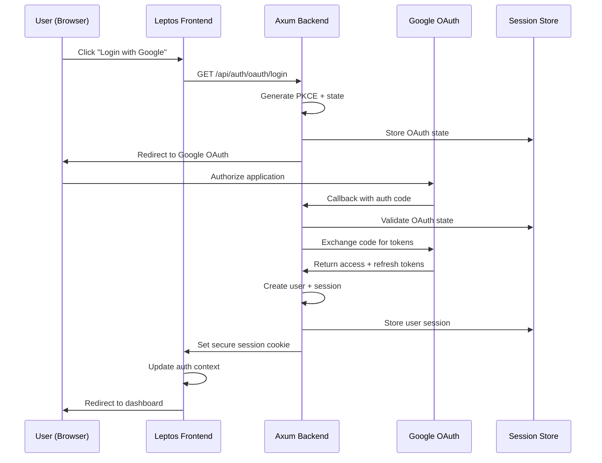
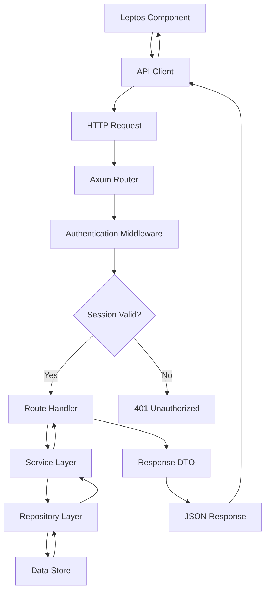

# System Architecture

## Overview

Comprehensive system architecture for the Leptos fullstack Rust Cloudflare worker application with Google OAuth integration.

## Technology Stack

### Backend (Axum Worker)
```yaml
runtime: Cloudflare Workers (WASM)
framework: Axum 0.8.4
worker_runtime: worker 0.6.1
session_management:
  - tower-sessions 0.14.0
  - tower-cookies 0.11.0
database: tokio-postgres (WASM-compatible)
authentication: Google OAuth 2.0 + PKCE
error_handling: Comprehensive AppError system
logging: tracing + tracing-wasm
```

### Frontend (Leptos)
```yaml
framework: Leptos (WASM)
state_management: leptos-use
routing: leptos_router
http_client: reqwest (WASM-compatible)
authentication: Cookie-based sessions
styling: Tailwind CSS (optional)
build_tool: trunk
```

### Infrastructure
```yaml
deployment_platform: Cloudflare Workers
edge_locations: Global edge network
storage: PostgreSQL (via worker::Socket)
cdn: Cloudflare CDN
ssl: Automatic HTTPS
domain_management: Cloudflare DNS
```

## System Components

### 1. Backend Architecture (Axum Worker)

```
src/
├── lib.rs              # WASM entry point + fetch handler
├── state.rs            # Dependency injection container
├── error.rs            # Centralized error handling
├── routes/             # Route definitions
│   ├── mod.rs          # Master router configuration
│   ├── auth.rs         # Authentication routes
│   ├── health.rs       # Health check routes
│   └── gmail.rs        # Future Gmail API routes
├── handler/            # Request handlers
│   ├── mod.rs
│   ├── auth.rs         # OAuth flow handlers
│   ├── health.rs       # Health check handlers
│   └── user.rs         # User management handlers
├── service/            # Business logic layer
│   ├── mod.rs
│   ├── auth.rs         # Authentication service
│   ├── oauth.rs        # OAuth integration service
│   ├── session.rs      # Session management service
│   └── user.rs         # User management service
├── repository/         # Data access layer
│   ├── mod.rs
│   ├── user.rs         # User data repository
│   └── session.rs      # Session storage repository
├── middleware/         # Cross-cutting concerns
│   ├── mod.rs
│   ├── auth.rs         # Authentication middleware
│   ├── cors.rs         # CORS handling
│   └── logging.rs      # Request logging
├── entity/             # Data models
│   ├── mod.rs
│   ├── user.rs         # User entity
│   ├── session.rs      # Session entity
│   └── oauth.rs        # OAuth token entity
├── dto/                # API contracts
│   ├── mod.rs
│   ├── auth.rs         # Authentication DTOs
│   ├── user.rs         # User DTOs
│   └── response.rs     # Standard API responses
└── client/             # External service clients
    └── mod.rs
```

### 2. Frontend Architecture (Leptos)

```
src/
├── app.rs              # Main application component
├── components/         # Reusable UI components
│   ├── auth/
│   │   ├── auth_provider.rs    # Authentication context
│   │   ├── login_button.rs     # Google login button
│   │   ├── logout_button.rs    # Logout functionality
│   │   └── user_profile.rs     # User profile display
│   ├── layout/
│   │   ├── header.rs           # Application header
│   │   ├── sidebar.rs          # Navigation sidebar
│   │   └── protected_route.rs  # Route protection
│   └── common/
│       ├── loading_spinner.rs  # Loading indicators
│       └── error_message.rs    # Error displays
├── pages/              # Page components
│   ├── home.rs         # Landing page
│   ├── login.rs        # Authentication page
│   ├── dashboard.rs    # Main dashboard
│   └── profile.rs      # User profile page
├── services/           # API integration
│   ├── auth_service.rs # Authentication API calls
│   └── api_client.rs   # HTTP client wrapper
├── types/              # Type definitions
│   └── auth.rs         # Authentication types
└── utils/              # Utility functions
    ├── cookies.rs      # Cookie management
    └── routes.rs       # Route definitions
```

## Data Flow Architecture

### Authentication Flow


### API Request Flow


## Security Architecture

### Authentication Security
```yaml
oauth_flow:
  - PKCE (Proof Key for Code Exchange)
  - State parameter for CSRF protection
  - Secure redirect URI validation
  - Token expiration handling

session_management:
  - HTTPOnly cookies (XSS protection)
  - Secure flag (HTTPS only)
  - SameSite=Lax (CSRF protection)
  - 24-hour expiration
  - Automatic cleanup of expired sessions

token_security:
  - Access tokens in memory only
  - Refresh tokens in secure cookies
  - Token rotation on refresh
  - Scope-limited permissions
```

### API Security
```yaml
request_protection:
  - CORS with credential support
  - Content-Type validation
  - Request size limits
  - Rate limiting (future)

response_security:
  - Security headers (X-Frame-Options, etc.)
  - No sensitive data in error responses
  - Structured error codes
  - Request/response logging

middleware_stack:
  - Authentication middleware
  - CORS handling
  - Request logging
  - Error handling
```

## Performance Architecture

### WASM Optimization
```yaml
backend_optimization:
  - Cloudflare Workers V8 isolates
  - Sub-millisecond cold starts
  - Edge compute distribution
  - Automatic scaling

frontend_optimization:
  - Leptos SSR capability
  - WASM binary optimization
  - Code splitting support
  - Asset optimization
```

### Caching Strategy
```yaml
session_caching:
  - In-memory session store
  - Automatic cleanup
  - LRU eviction (future)
  
api_caching:
  - HTTP cache headers
  - Cloudflare edge caching
  - Static asset caching
  
user_data_caching:
  - Browser session storage
  - Reactive state management
  - Optimistic updates
```

## Deployment Architecture

### Cloudflare Workers Deployment
```yaml
backend_deployment:
  - wrangler.toml configuration
  - Environment variable management
  - Automatic HTTPS
  - Global edge distribution

frontend_deployment:
  - Trunk build process
  - WASM optimization
  - Static asset handling
  - Service worker registration
```

### Environment Configuration
```yaml
development:
  - Local development with wrangler dev
  - Hot reloading support
  - Local database connection
  - Development OAuth credentials

production:
  - Cloudflare Workers production
  - Production OAuth credentials
  - Secure cookie settings
  - Performance monitoring
```

## Scalability Considerations

### Horizontal Scaling
```yaml
worker_scaling:
  - Automatic scaling with demand
  - Zero-configuration scaling
  - Global edge distribution
  - Load balancing by Cloudflare

session_scaling:
  - Distributed session store (future)
  - Redis integration (future)
  - Session replication (future)
```

### Performance Monitoring
```yaml
metrics:
  - Request/response times
  - Error rates
  - Session creation/validation
  - OAuth flow completion rates

alerting:
  - Error rate thresholds
  - Performance degradation
  - Authentication failures
  - Service availability
```

## Integration Points

### External Services
```yaml
google_oauth:
  - OAuth 2.0 authorization server
  - User info API
  - Token refresh endpoint
  - JWKS for token validation

gmail_api:
  - Gmail API integration (future)
  - Message reading/writing
  - Label management
  - Search functionality
```

### Database Integration
```yaml
postgresql:
  - User data persistence
  - Session storage
  - Audit logging
  - Configuration storage

connection_management:
  - Connection pooling
  - Automatic reconnection
  - Query optimization
  - Transaction management
```

## Development Workflow

### Local Development
```bash
# Backend development
cd axum-worker
wrangler dev

# Frontend development  
cd leptos-frontend
trunk serve

# Database setup
docker run -d -p 5432:5432 postgres
```

### Testing Strategy
```yaml
unit_tests:
  - Service layer tests
  - Repository tests
  - Component tests
  - Utility function tests

integration_tests:
  - API endpoint tests
  - Authentication flow tests
  - Database integration tests
  - Frontend integration tests

e2e_tests:
  - Complete user workflows
  - Cross-browser testing
  - Performance testing
  - Security testing
```

## Maintenance and Monitoring

### Health Monitoring
```yaml
health_endpoints:
  - /api/health - Basic health check
  - /api/health/detailed - Comprehensive status
  - Service dependency checks
  - Database connectivity

metrics_collection:
  - Request latency
  - Error rates
  - Authentication success rates
  - Resource usage
```

### Logging and Debugging
```yaml
structured_logging:
  - Request/response logging
  - Authentication events
  - Error tracking
  - Performance metrics

debugging_tools:
  - Cloudflare Workers logs
  - Browser developer tools
  - Error tracking integration
  - Performance profiling
```

This architecture provides a robust, scalable, and secure foundation for the Leptos fullstack application with comprehensive authentication and API integration capabilities.