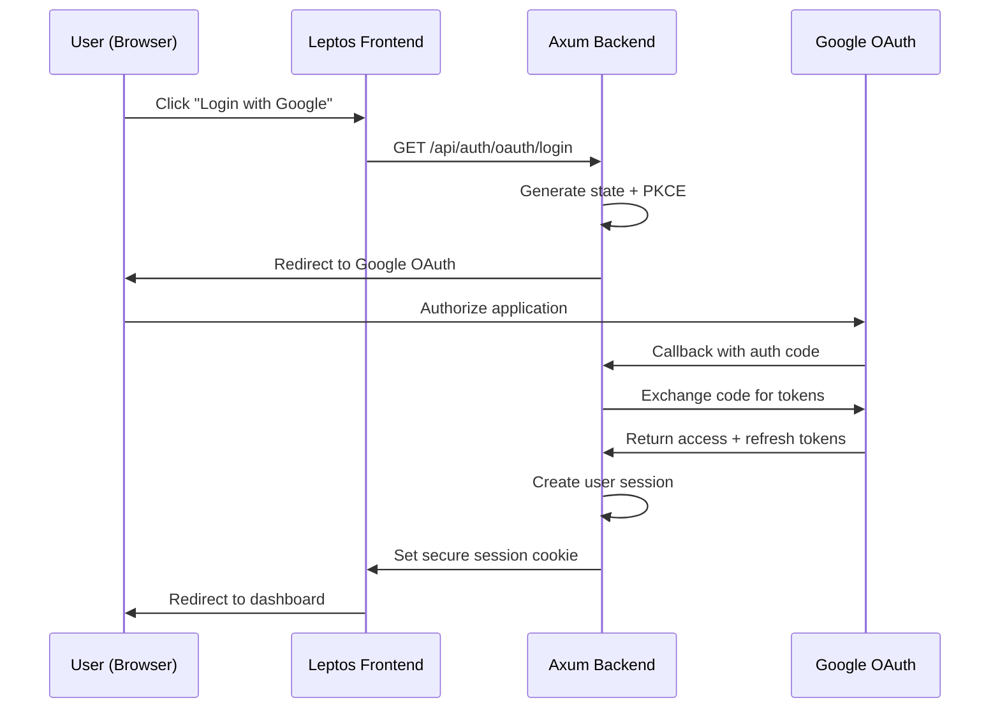

# Phase 2: Authentication Implementation

**Duration**: 3-4 days  
**Priority**: High  
**Prerequisites**: Phase 1 completed  
**Status**: Ready for implementation after Phase 1

## Overview

Implement complete Google OAuth 2.0 authentication flow with secure session management optimized for Cloudflare Workers WASM environment.


### Given Credentials for google oAuth
email: the.last.tajae@gmail.com
password: AppleHead123

## Google OAuth 2.0 Flow Architecture



## Implementation Tasks

### 1. OAuth Configuration & Environment Variables

#### Required Environment Variables
Add to Cloudflare Workers environment:
```bash
GOOGLE_CLIENT_ID
GOOGLE_CLIENT_SECRET
GOOGLE_REDIRECT_URI
SESSION_SECRET
ENVIRONMENT
BASE_URL
```

#### OAuth Configuration Enhancement
Enhance `src/state.rs` GoogleOAuthConfig:
```rust
pub struct GoogleOAuthConfig {
    pub client_id: String,
    pub client_secret: String,
    pub redirect_uri: String,
    pub auth_url: String,
    pub token_url: String,
    pub scopes: Vec<String>,          // NEW
    pub code_challenge_method: String, // NEW for PKCE
}
```

### 2. Entity Implementations

#### User Entity (`src/entity/user.rs`)
```rust
#[derive(Debug, Clone, Serialize, Deserialize)]
pub struct User {
    pub id: String,                    // UUID v4
    pub email: String,                 // From Google OAuth
    pub username: Option<String>,          // Display name
    pub first_name: Option<String>,          // Display 
    pub last_name: Option<String>,          // Display
    pub password: Option<String>,       // Avatar URL
    pub created_at: chrono::DateTime<chrono::Utc>,
}


```

#### Session Entity (`src/entity/session.rs`)
```rust
#[derive(Debug, Clone, Serialize, Deserialize)]
pub struct UserSession {
    pub session_id: String,            // UUID v4
    pub user_id: String,               // Reference to 
    pub token_id String,
    pub expires_at: chrono::DateTime<chrono::Utc>,
    pub created_at: chrono::DateTime<chrono::Utc>,
    pub user_agent: Option<String>,    // Security tracking
    pub ip_address: Option<String>,    // Security tracking
}


```

#### OAuth State DTO (`src/dto/oauth.rs`)
```rust
#[derive(Debug, Clone, Serialize, Deserialize)]
pub struct OAuthState {
    pub state: String,                 // CSRF protection
    pub code_verifier: String,         // PKCE code verifier
    pub code_challenge: String,        // PKCE code challenge
    pub redirect_after_login: Option<String>, // Deep linking
    pub created_at: chrono::DateTime<chrono::Utc>,
    pub expires_at: chrono::DateTime<chrono::Utc>,
}
```

### 3. Repository Pattern Implementation

#### Session Repository (`src/repository/session.rs`)
```rust
pub struct SessionRepository {
    // In-memory store for WASM compatibility
    sessions: Arc<RwLock<HashMap<String, UserSession>>>,
}

impl SessionRepository {
    pub async fn create_session(&self, session: UserSession) -> Result<String, AppError>;
    pub async fn get_session(&self, session_id: &str) -> Result<Option<UserSession>, AppError>;
    pub async fn update_session(&self, session_id: &str, session: UserSession) -> Result<(), AppError>;
    pub async fn delete_session(&self, session_id: &str) -> Result<(), AppError>;
    pub async fn cleanup_expired_sessions(&self) -> Result<u32, AppError>;
    pub async fn get_user_sessions(&self, user_id: &str) -> Result<Vec<UserSession>, AppError>;
}
```

#### User Repository (`src/repository/user.rs`)
```rust
pub struct UserRepository {
    users: Arc<RwLock<HashMap<String, User>>>,
}

impl UserRepository {
    pub async fn create_user(&self, user: User) -> Result<String, AppError>;
    pub async fn get_user_by_id(&self, user_id: &str) -> Result<Option<User>, AppError>;
    pub async fn get_user_by_email(&self, email: &str) -> Result<Option<User>, AppError>;
    pub async fn update_user(&self, user: User) -> Result<(), AppError>;
    pub async fn delete_user(&self, user_id: &str) -> Result<(), AppError>;
}
```

### 4. OAuth Service Implementation

#### Enhanced OAuth Service (`src/service/oauth.rs`)
```rust
pub struct OAuthService {
    config: GoogleOAuthConfig,
    http_client: reqwest::Client,
    state_store: Arc<RwLock<HashMap<String, OAuthState>>>,
}

impl OAuthService {
    // PKCE implementation
    pub fn generate_pkce_pair() -> (String, String);
    
    // OAuth URL generation
    pub async fn create_authorization_url(&self, redirect_after: Option<String>) -> Result<(String, String), AppError>;
    
    // Token exchange
    pub async fn exchange_code_for_tokens(&self, code: &str, state: &str) -> Result<GoogleTokenResponse, AppError>;
    
    // Token refresh
    pub async fn refresh_access_token(&self, refresh_token: &str) -> Result<GoogleTokenResponse, AppError>;
    
    // User info retrieval
    pub async fn get_user_info(&self, access_token: &str) -> Result<GoogleUserInfo, AppError>;
}
```

### 5. Authentication Handlers

#### Auth Handler (`src/handler/auth.rs`)
```rust
// GET /api/auth/oauth/login
pub async fn oauth_login(
    Query(params): Query<OAuthLoginParams>,
    State(state): State<AppState>,
) -> Result<Redirect, AppError>;

// GET /api/auth/oauth/callback  
pub async fn oauth_callback(
    Query(params): Query<OAuthCallbackParams>,
    mut cookies: Cookies,
    State(state): State<AppState>,
) -> Result<Redirect, AppError>;

// POST /api/auth/refresh
pub async fn refresh_token(
    cookies: Cookies,
    State(state): State<AppState>,
) -> Result<Json<ApiResponse<TokenRefreshResponse>>, AppError>;

// POST /api/auth/logout
pub async fn logout(
    mut cookies: Cookies,
    State(state): State<AppState>,
) -> Result<Json<ApiResponse<()>>, AppError>;

// GET /api/auth/user
pub async fn get_current_user(
    cookies: Cookies,
    State(state): State<AppState>,
) -> Result<Json<ApiResponse<User>>, AppError>;
```

### 6. Session Management & Cookie Configuration

#### WASM-Compatible Session Store
```rust
// src/service/session.rs
pub struct SessionService {
    session_repo: Arc<SessionRepository>,
    user_repo: Arc<UserRepository>,
    session_duration: Duration,
}

impl SessionService {
    pub async fn create_user_session(
        &self,
        user: User,
        access_token: String,
        refresh_token: Option<String>,
        token_expires_at: chrono::DateTime<chrono::Utc>,
        user_agent: Option<String>,
        ip_address: Option<String>,
    ) -> Result<String, AppError>;
    
    pub async fn validate_session(&self, session_id: &str) -> Result<(User, UserSession), AppError>;
    pub async fn refresh_session(&self, session_id: &str) -> Result<UserSession, AppError>;
    pub async fn end_session(&self, session_id: &str) -> Result<(), AppError>;
    pub async fn cleanup_expired_sessions(&self) -> Result<u32, AppError>;
}
```

#### Secure Cookie Configuration
```rust
// Enhanced cookie settings in routes/mod.rs
let cookie_layer = CookieManagerLayer::new();
let session_layer = SessionManagerLayer::new(session_store)
    .with_secure(true)                    // HTTPS only in production
    .with_http_only(true)                // Prevent XSS
    .with_same_site(tower_cookies::SameSite::Lax) // CSRF protection
    .with_path("/")                       // Application-wide
    .with_domain(None)                   // Same domain only
    .with_expiry(Expiry::OnInactivity(Duration::hours(24)));
```

## Implementation Checklist

### OAuth Configuration
- [ ] Add Google OAuth environment variables
- [ ] Enhance GoogleOAuthConfig with scopes and PKCE
- [ ] Update AppState initialization

### Entity Layer
- [ ] Implement User entity with Google OAuth fields
- [ ] Implement UserSession entity with security tracking
- [ ] Implement OAuthState entity for CSRF/PKCE
- [ ] Add proper serialization/deserialization

### Repository Layer
- [ ] Implement SessionRepository with WASM-compatible storage
- [ ] Implement UserRepository with CRUD operations
- [ ] Add cleanup and maintenance operations
- [ ] Include error handling and logging

### Service Layer
- [ ] Complete OAuthService with PKCE implementation
- [ ] Implement SessionService for session lifecycle
- [ ] Add token refresh and validation logic
- [ ] Include comprehensive error handling

### Handler Layer
- [ ] Implement OAuth login initiation endpoint
- [ ] Implement OAuth callback handler
- [ ] Implement token refresh endpoint
- [ ] Implement logout with session cleanup
- [ ] Implement current user endpoint

### Security & Validation
- [ ] PKCE implementation for OAuth security
- [ ] CSRF protection with state parameter
- [ ] Secure cookie configuration
- [ ] Session expiration and cleanup
- [ ] Request validation and sanitization

## Testing Strategy

### Unit Tests
```rust
// Test OAuth URL generation
#[tokio::test]
async fn test_authorization_url_generation() { /* ... */ }

// Test PKCE code generation
#[tokio::test] 
async fn test_pkce_generation() { /* ... */ }

// Test token exchange
#[tokio::test]
async fn test_token_exchange() { /* ... */ }
```

### Integration Tests
```bash
# Test OAuth flow endpoints
curl -X GET http://localhost/api/auth/oauth/login
curl -X GET http://localhost/api/auth/user
```

## Security Considerations

✅ **PKCE Implementation** - Prevent authorization code interception  
✅ **State Parameter** - CSRF protection during OAuth flow  
✅ **Secure Cookies** - HTTPOnly, Secure, SameSite protection  
✅ **Token Expiration** - Proper token lifecycle management  
✅ **Session Cleanup** - Automatic expired session removal  
✅ **Input Validation** - Sanitize all OAuth callback parameters

## Success Criteria

✅ **OAuth Flow** - Complete Google OAuth 2.0 authentication  
✅ **Session Management** - Secure session creation and validation  
✅ **Token Handling** - Proper access/refresh token management  
✅ **Security** - PKCE, CSRF protection, secure cookies  
✅ **Error Handling** - Comprehensive error responses  
✅ **WASM Compatibility** - All components work in Cloudflare Workers

## Next Phase

Once Phase 2 is complete, proceed to [Phase 3: API Implementation](./phase-3-api.md)